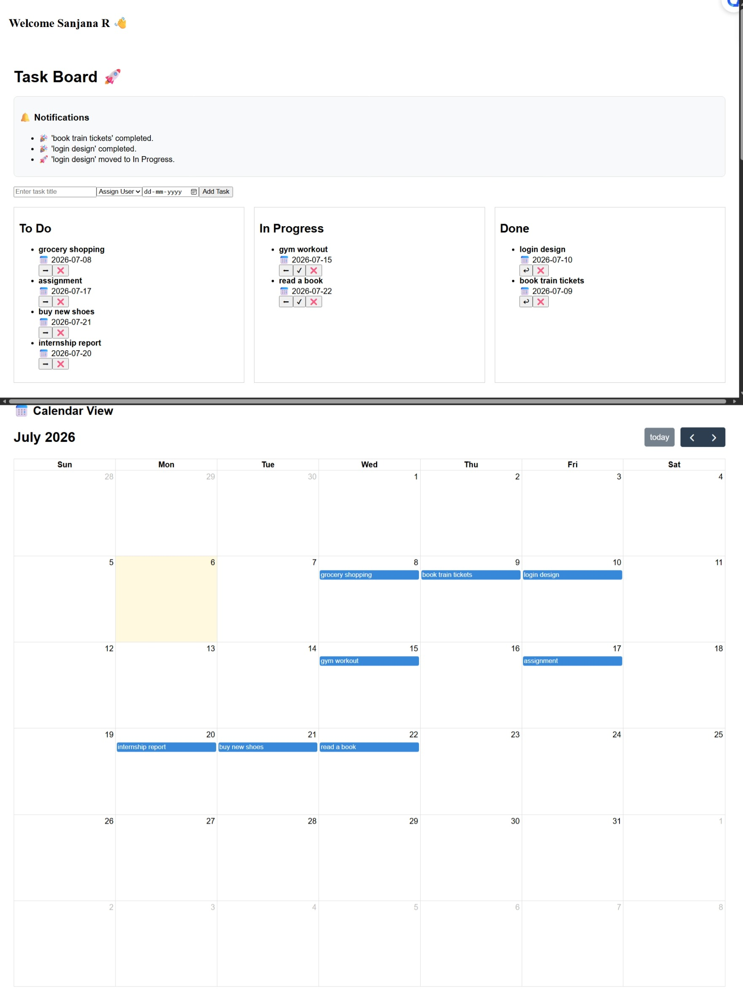

# Advanced Task Management System

A full-stack task management application built using **Vue.js, Laravel, and MySQL**.

---

## 🚀 Features

- User Login system
- Task creation and assignment
- Task tracking (To Do / In Progress / Done)
- Kanban board view
- Calendar integration for tasks
- Notifications system
- Dashboard overview

---

## 🛠 Tech Stack

- Frontend: Vue.js
- Backend: Laravel
- Database: MySQL

---

## 📸 Screenshots

### Login Page

### Dashboard

---

## 📌 Project Description

This system allows users to manage tasks efficiently with collaboration features like assignment, tracking, and scheduling.

---

## 👨‍💻 Author

Sanjana R